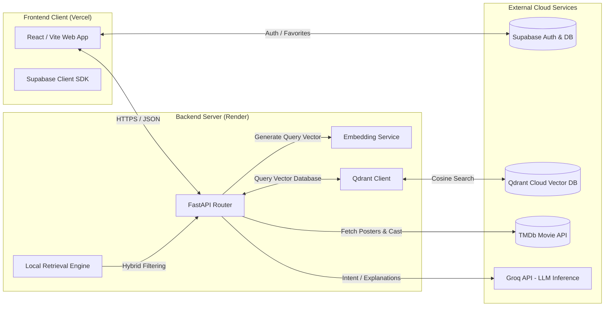
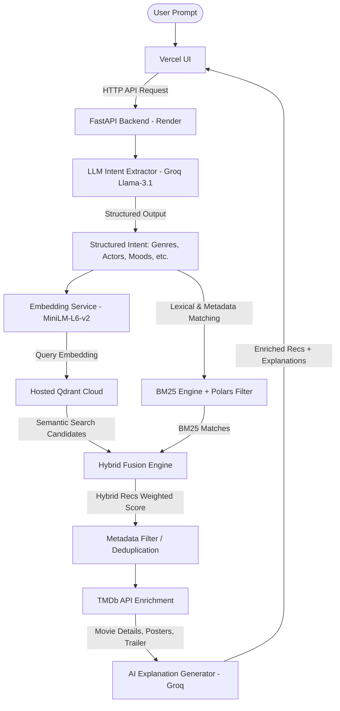

# ChitraAI

[](https://vite.dev)
[](https://fastapi.tiangolo.com)
[](https://qdrant.tech)
[](https://groq.com)
[](https://supabase.com)
[](https://opensource.org/licenses/MIT)

ChitraAI is a state-of-the-art, AI-powered semantic movie recommendation system. By leveraging natural language processing (NLP), vector search, and hybrid candidate ranking, ChitraAI allows users to discover movies using complex, conversational queries like *"show me gritty cyberpunk thrillers similar to Blade Runner with deep philosophical themes"* instead of basic keyword searches.


---

## Table of Contents
1. [Features Implemented](#features-implemented)
2. [Architecture & Process Flow](#architecture--process-flow)
3. [Technology Stack](#technology-stack)
4. [APIs & Third-Party Integrations](#apis--third-party-integrations)
5. [Project Structure](#project-structure)
6. [Setup Instructions](#setup-instructions)
7. [Environment Variables](#environment-variables)
8. [Recommendation Pipeline](#recommendation-pipeline)
9. [Deployment](#deployment)
10. [Future Improvements](#future-improvements)
11. [License](#license)

---

## Features Implemented

- **Natural Language Movie Search**: Converse naturally with the recommendation engine to find movies matching exact moods, themes, plots, or eras.
- **LLM-Based Intent Extraction**: Utilizes a LLM (via Groq/OpenAI) to convert raw user queries into structured constraints (preferred/avoided genres, actors, directors, moods, themes, release windows).
- **Qdrant Cloud Hosted Vector Search**: Replaces local vector indexes with a secure, production-grade cloud cluster running cosine similarity searches on 384-dimensional dense vectors.
- **Hybrid Fusion Ranking**: Merges vector search scores with lexical keyword scores (BM25 Okapi) and metadata weights (popularity, release year, rating) for balanced results.
- **TMDb Metadata Integration**: Dynamically enriches results with high-resolution posters, official trailers, crew details, cast members, and user ratings.
- **AI-Generated Recommendation Explanations**: Provides context-aware natural language explanations for *why* each movie is recommended to the user based on their query.
- **Supabase Authentication**: Secure user login, registration, guest session handling, and persistent user-level watchlists.
- **Favorites & Watchlist System**: Interactive UI allowing users to favorite movies, which are synchronized to a hosted PostgreSQL database via Supabase.
- **Guest Search Limits**: Implements client-side and server-side rate limits for unregistered guest searches to control API token consumption.
- **Dataset Explorer**: Includes a responsive interface displaying the catalog of 45,000+ movies indexed in the system, with details on the precomputed embeddings.
- **Responsive UI**: Sleek, dark-mode glassmorphic user interface built with Vite, Tailwind CSS, Framer Motion, and GSAP micro-animations.

---

## Architecture & Process Flow

ChitraAI splits its logic between a client-side application (React + Vite) and a memory-optimized FastAPI backend. 

### High-Level System Architecture


### Recommendation Pipeline Flow
The following sequence details how a query gets converted into a set of recommendations:



---

## Technology Stack

### Frontend
* **Core**: React 19, TypeScript
* **Build Tool**: Vite 8
* **Styling**: Tailwind CSS 4, Vanilla CSS
* **Animations**: Framer Motion 12, GSAP 3 (for premium micro-interactions)
* **Routing & State**: React Router 7, Zustand 5, React Query (TanStack) 5

### Backend
* **Core Framework**: FastAPI (Python 3.13 / 3.14)
* **Server**: Uvicorn
* **Data Processing**: Polars (highly efficient parquet parsing and structured manipulation)
* **Logging & Profiling**: Loguru, native OS resident set size memory monitoring

### Database & Embeddings
* **Relational Database**: PostgreSQL (via Supabase)
* **Vector Database**: Qdrant Cloud (Hosted)
* **Embedding Model**: `all-MiniLM-L6-v2` (384-dimensional dense vectors)
* **Lexical Search**: BM25 Okapi (`rank_bm25`)

---

## APIs & Third-Party Integrations

1. **TMDb API**: Used for dynamically retrieving real-time movie details, high-resolution posters, backdrops, actors' profile links, ratings, and video trailers.
2. **Qdrant Cloud**: A hosted vector database storing precomputed L2-normalized embeddings for the entire movie catalog to enable instant cosine similarity queries.
3. **Groq API**: Exposes high-throughput LLM endpoints (`llama-3.1-8b-instant`) used to extract search intent structures and formulate customized recommendations reasons.
4. **Supabase**: Handles production auth sessions, signup/login flows, and syncs the favorites/watchlist collections to a hosted PostgreSQL instance.

---

## Project Structure

```text
ChitraAI/
├── backend/                 # FastAPI Backend Code
│   ├── app/
│   │   ├── api/             # API Routers, endpoints, and dependencies
│   │   ├── core/            # Configuration settings, logging, model loading
│   │   ├── datasets/        # Movie metadata and dataset loaders
│   │   ├── pipelines/       # Preprocessing & indexing workflows
│   │   ├── scripts/         # Ingestion and canonical dataset rebuild utilities
│   │   └── services/        # Recommendation, search, and external API interfaces
│   ├── main.py              # Application entry point & lifespan manager
│   ├── requirements.txt     # Backend python dependencies
│   └── tests/               # Pytest suite
├── frontend/                # React + Vite Frontend Code
│   ├── public/              # Static assets
│   ├── src/
│   │   ├── assets/          # Posters, videos, custom graphics
│   │   ├── components/      # UI components (visual pipelines, panels)
│   │   ├── contexts/        # Auth & State Contexts
│   │   ├── hooks/           # Custom API & Favourites hooks
│   │   ├── lib/             # Supabase and axios clients
│   │   ├── pages/           # Views (Home, Dataset Explorer, Profile)
│   │   └── services/        # Frontend API connectors
│   ├── tsconfig.json        # TypeScript configuration
│   └── package.json         # NPM scripts and frontend packages
├── design.md                # System design briefs
└── README.md                # Project documentation
```

---

## Setup Instructions

<details>
<summary><b>1. Backend Setup (Local)</b></summary>

1. Navigate to the backend directory:
   ```bash
   cd backend
   ```
2. Create and activate a Python virtual environment:
   ```bash
   python -m venv .venv
   # On Windows:
   .venv\Scripts\activate
   # On macOS/Linux:
   source .venv/bin/activate
   ```
3. Install backend dependencies:
   ```bash
   pip install -r requirements.txt
   ```
4. Create a `.env` file based on `.env.example`:
   ```bash
   cp .env.example .env
   ```
   *(Fill in your `TMDB_API_KEY`, `GROQ_API_KEY`, `QDRANT_URL`, and `QDRANT_API_KEY`)*
5. Run the one-time dataset ingestion script to populate Qdrant Cloud (ensure embeddings are generated):
   ```bash
   python app/scripts/ingest_to_qdrant.py
   ```
6. Start the API server:
   ```bash
   uvicorn main:app --host 0.0.0.0 --port 8000 --reload
   ```
</details>

<details>
<summary><b>2. Frontend Setup (Local)</b></summary>

1. Navigate to the frontend directory:
   ```bash
   cd frontend
   ```
2. Install Node.js packages:
   ```bash
   npm install
   ```
3. Create a `.env.local` file:
   ```bash
   cp .env.example .env.local
   ```
   *(Ensure `VITE_API_BASE_URL` points to your backend instance, e.g., `http://localhost:8000/api/v1`)*
4. Run the local development server:
   ```bash
   npm run dev
   ```
</details>

---

## Environment Variables

### Backend (`backend/.env`)
| Variable | Required | Description |
| :--- | :--- | :--- |
| `TMDB_API_KEY` | Yes | API key for fetching movie details, cast, and posters. |
| `GROQ_API_KEY` | Yes | API key for Groq LLM intent parsing and explanations. |
| `QDRANT_URL` | Yes | Deployed Qdrant Cloud cluster endpoint. |
| `QDRANT_API_KEY` | Yes | Access key for authentication with Qdrant Cloud. |
| `CORS_ORIGINS` | No | Comma-separated list of allowed origins (e.g. your Vercel URL). |

### Frontend (`frontend/.env.local`)
| Variable | Required | Description |
| :--- | :--- | :--- |
| `VITE_API_BASE_URL` | Yes | Backend URL (e.g., `https://your-backend.onrender.com/api/v1`). |
| `VITE_SUPABASE_URL` | Yes | Supabase project URL for authentication. |
| `VITE_SUPABASE_ANON_KEY` | Yes | Supabase public anonymous API key. |

---

## Recommendation Pipeline

The recommendation pipeline runs in four stages:

1. **Query Deconstruction**: The conversational search string is fed to a Groq LLM instance. The LLM produces a structured JSON output classifying genres, target decades, key actors, themes, and emotional tone.
2. **Dense Vector Search**: The text embedding model (`all-MiniLM-L6-v2`) encodes the search criteria. The resulting vector queries the hosted Qdrant Cloud database using cosine similarity to return the top 1,000 nearest semantic candidates.
3. **Lexical & Metadata Reciprocal Rank Fusion (RRF)**: A BM25 index built from movie plots is queried for keyword matches. Polars fuses semantic similarity scores, lexical scores, movie ratings, and popularity curves using reciprocal rank fusion to produce the top 20 ranked candidates.
4. **Contextual Explanation & Enrichment**: The backend hits the TMDb API to pull live images, genres, ratings, and video links. It then invokes Groq to compare the structured query profile against the movie plots, generating human-readable explanations of why each movie fits.

---

## Deployment

* **Frontend**: Deployed on **Vercel** with global edge optimization.
* **Backend**: Deployed on **Render** (monitored and optimized to run startup memory under **238 MB** RSS, remaining safely below Render's Free 512 MB ceiling).
* **Vector Database**: Deployed on a managed **Qdrant Cloud** instance.

---

## Future Improvements

* **Collaborative Filtering Hybridization**: Integrating user watchlist/history tracking with an ALS matrix factorization model to inject collaborative data.
* **Continuous User Preference Tuning**: Analyzing query-click histories to automatically adjust weights between semantic, lexical, and popularity factors.
* **Streaming Provider Deep-Linking**: Querying JustWatch API to display where recommendations are currently streaming in the user's region.
* **Multi-Language Search Support**: Utilizing multilingual sentence encoders (`paraphrase-multilingual-MiniLM-L12-v2`) to allow queries in Spanish, French, Hindi, and other languages.

---

## License

This project is licensed under the MIT License - see the [LICENSE](LICENSE) file for details.
