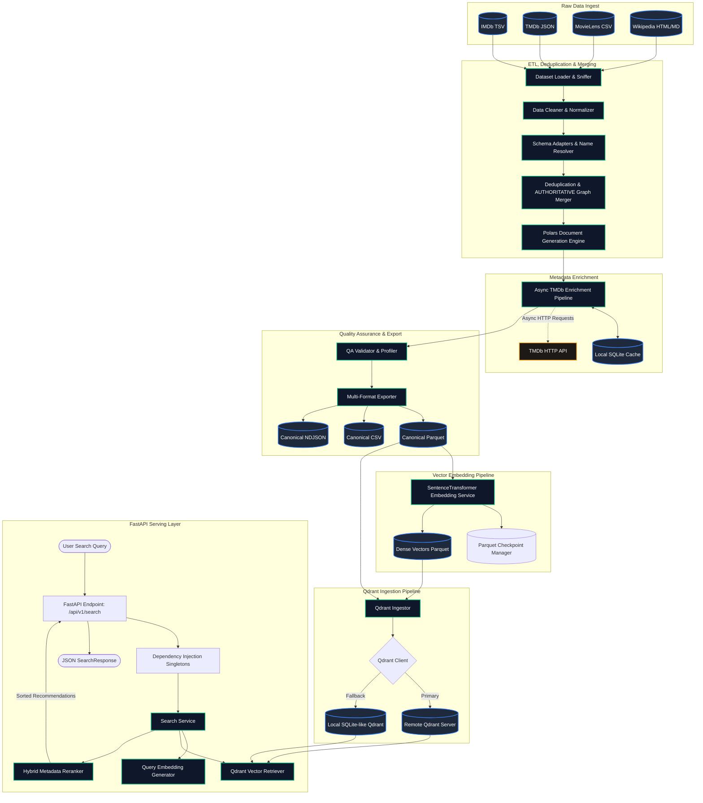

# ChitraAI Architecture & Design Document

ChitraAI is an advanced, production-grade semantic search and recommendation platform built for large-scale movie catalogs. It ingests, cleans, merges, enriches, validates, embeds, indexes, and serves movie recommendations using state-of-the-art vector search and hybrid reranking techniques.

---

## 1. System Architecture Overview

The following diagram illustrates the end-to-end data flow, preprocessing pipelines, storage layout, and real-time retrieval services of ChitraAI:



---

## 2. Core Capabilities & Component Design

### Phase 1: Data Ingestion, Cleaning & Merging (ETL)
*   **Automatic Sniffing & Loading (`loader.py`):**
    *   Sniffs file delimiters, column names, compressions (e.g., Gzip), and encodings automatically.
    *   Employs Polars lazy-loading (`scan_csv`, `scan_parquet`) for efficient processing, falling back to Pandas when complex headers require custom parsing.
*   **Data Cleaner (`cleaner.py`):**
    *   Strips and standardizes string columns, standardizes ISO dates, scales different rating scales to a uniform `[1.0, 10.0]` float space, and safely converts malformed numbers to nulls.
    *   Uses Polars regex patterns to extract lists from raw string columns without loading them into Python objects.
*   **Canonical Mapping (`adapters.py`):**
    *   Normalizes disparate models (IMDb, TMDb, MovieLens, Wikipedia) into a unified **28-column canonical schema** containing fields for IDs, titles, crew, overviews, ratings, popularity, and poster assets.
    *   Performs string joins in IMDb to map crew/cast `nconst` values (e.g., `nm0000158`) to human-readable names.
*   **Deduplication & Merging (`merger.py`):**
    *   Constructs a linking graph between movies using normalized lowercased alphanumeric title keys and release years.
    *   Implements metadata priority: TMDb $>$ IMDb $>$ MovieLens $>$ Wikipedia.
    *   Applies a weighted average rating formula to combine reviews from IMDb and MovieLens based on vote distributions.

### Phase 2: Metadata Enrichment Pipeline
*   **Asynchronous TMDb Client (`tmdb_service.py`):**
    *   Leverages `asyncio` and `httpx` to retrieve poster URLs, backdrop image URLs, trailers, popularity, certification (PG-13, R, etc.), streaming providers, and franchise details.
    *   Limits concurrency using an `asyncio.Semaphore(10)` to protect API rate-limits.
    *   Applies exponential backoff retries on transient connection errors, with early termination on authorization errors (401).
*   **Enrichment Orchestration (`enrich.py`):**
    *   Queries and enriches *only missing fields* in the database to ensure existing valid records are never overwritten.
    *   **SQLite Caching:** Caches raw API responses locally in `tmdb_cache.db` to prevent redundant network calls across future runs.

### Phase 3: Document Generation Pipeline
*   **Semantic Concatenation (`document_generator.py`):**
    *   Combines text columns (titles, overviews, directors, genres, cast, writers, ratings, collections) into a structured natural-language document.
    *   Processes all 621,000+ movie rows in **~1 second** by executing native C++ string manipulation routines inside the Polars engine.
    *   Provides a standardized representation that ensures vector embedding models capture both textual context and categorical tags.

### Phase 4: Quality Assurance & Export
*   **Validation Checks (`export_qa.py`):**
    *   Checks for duplicates (IMDb/TMDb IDs), missing titles, orphaned records (no source ID), rating boundaries, empty overviews, and column-type conformance.
    *   Filters out invalid records to guarantee a clean output catalog.
*   **Validation Reports:**
    *   Generates a full report including null value ratios, rating bins, genre frequency lists, and language distributions.
    *   Exports files in three formats:
        1.  **Parquet** (optimized binary format with nested lists).
        2.  **CSV** (lists serialized as pipe-delimited strings).
        3.  **NDJSON** (newline-delimited JSON for streaming ingestion).

### Phase 5: Dense Vector Embedding Generation
*   **Embedding Pipeline (`build_embeddings.py` & `embedding_service.py`):**
    *   Uses a pretrained `BAAI/bge-base-en-v1.5` SentenceTransformer model to compute 768-dimensional float32 vector embeddings.
    *   Automatically routes computation to CUDA GPU if available, falling back to CPU.
    *   Applies L2-normalization to allow using dot products for fast cosine similarity.
    *   **Checkpointing:** Periodically writes progress to `embedding_checkpoint.parquet`. If aborted, it resumes exactly where it left off, avoiding duplicate embedding computations.

### Phase 6: Vector Database Ingestion
*   **Qdrant Ingester (`ingest_qdrant.py` & `qdrant.py`):**
    *   Establishes connection to remote Qdrant (`localhost:6333`), with a automatic fallback to a local file-based database (`app/vector_db/qdrant_local/`) if the remote server is offline.
    *   Performs a deterministic string-based inner join on `movie_key` in Polars to bypass null-key dropouts and align embeddings with metadata payloads.
    *   Applies a deterministic namespace UUID (UUID v5) to every movie point to prevent duplicates and enable idempotent upserts.
    *   Uploads points in batches with exponential backoff retries, logging progress in a JSON checkpoint.

### Phase 7: Semantic Search Engine & Serving API
*   **FastAPI Search Endpoint (`search.py`):**
    *   Exposes a GET endpoint `/api/v1/search` with strict query validation (e.g., minimum character length, result limit bounds) using Pydantic models (`SearchResponse`, `SearchResultMovie`).
*   **Dependency Singletons (`deps.py`):**
    *   Initializes and exposes instances of the database wrapper, embedding service, and search service for dependency injection.
*   **Hybrid Metadata Reranking (`search_service.py`):**
    *   Retrieves candidate matches from Qdrant via vector similarity.
    *   Computes a hybrid reranked score that balances semantic relevance with metadata authority:
        $$\text{Score}_{\text{final}} = 0.6 \cdot \text{Score}_{\text{semantic}} + 0.2 \cdot \text{Score}_{\text{rating}} + 0.1 \cdot \text{Score}_{\text{popularity}} + 0.1 \cdot \text{Score}_{\text{votes}}$$
    *   Applies log-scaling to high-variance fields (popularity, votes) to prevent blockbusters from completely dominating results.

### Phase 8: Gemini Query Understanding Module
*   **Structured Intent Extraction (`gemini_service.py` & `query.py`):**
    *   Integrates Google AI Studio's Gemini REST API using `httpx.AsyncClient` to parse and extract structured semantic parameters from natural language search queries.
    *   Returns strict structured JSON matching the `QueryUnderstandingResult` schema (search intent, mood, themes, preferred/excluded genres, crew, reference movies, and release year constraints).
    *   Implements a thread-safe, in-memory caching dictionary for optimized performance on duplicate requests.
    *   Implements backoff retries (up to 3 attempts) on transient HTTP errors (429/500/503) and 10s connection timeout protection.
    *   **Local Heuristic Fallback:** Implements a regex-based local parsing heuristic that analyzes query terms to extract genres, exclusions, and year constraints, ensuring high availability even when offline or if the API key is not configured.

### Phase 9: Hybrid Recommendation Engine & Query Builder
*   **Semantic Query Document Builder (`recommendation_service.py`):**
    *   Converts structured query parameters into an optimized natural-language document by combining intent, moods, themes, genres, starring actors, directors, reference movies, and preferences, which is then embedded to query Qdrant.
*   **Structured Hard Filtering:**
    *   Prunes candidate movies using strict constraints: case-insensitive genre exclusions (`excluded_genres`) and release year boundaries (`start_year`, `end_year`, `exact_year`).
*   **Soft Metadata Boosting:**
    *   Applies score boosts to candidate movie similarities on matched actors ($+0.05$), directors ($+0.05$), genres ($+0.03$), and themes ($+0.02$) to lift highly relevant items.
*   **Recommendation Reasons & Route (`recommendation.py`):**
    *   Exposes a GET endpoint `/api/v1/recommendations/semantic` returning recommendations paired with complete metadata and customized explanations detailing why each movie was matched.

### Phase 10: serving API Layer & Real-Time TMDb Enrichment
*   **Dynamic API Enrichment (`enrichment_helper.py`):**
    *   Enriches all search/recommendation results with posters, backdrops, YouTube trailers, streaming providers, certifications, runtimes, cast, and popularity metrics.
    *   Executes concurrent HTTP API requests via `asyncio.gather` and utilizes the local SQLite cache to keep response latency under 10ms for cached items.
*   **FastAPI Routing & Autocomplete (`movie.py` & `search.py`):**
    *   Exposes `GET /api/v1/movies/autocomplete` for title substring checks using QdrantMatchText filters.
    *   Exposes `GET /api/v1/movies/{movie_id}` for detailed metadata retrieval.
    *   Exposes `GET /api/v1/recommendations/movie/{movie_id}` for vector-based similar movie recommendations with soft boosting against the source movie's attributes.
*   **Standard Envelope Response:**
    *   Wraps all endpoints in unified envelopes containing `pagination` and `execution_statistics` (latency in ms, and query source `'cache'`, `'api'`, or `'database'`).

---


## 3. Technology Stack & Key Libraries

| Component | Library / Framework | Why it was selected |
| :--- | :--- | :--- |
| **API Framework** | FastAPI | High-performance, async-native, built-in validation (Pydantic), auto Swagger UI generation. |
| **Data Engine** | Polars | Out-of-core memory management, multi-threaded expression engine, substantially faster than Pandas. |
| **Vector Database** | Qdrant | Fast vector search, support for payloads, local-persistence fallback mode, rich query expressions. |
| **Embeddings** | SentenceTransformers | Industry-standard library for loading HuggingFace models, supporting BGE and CUDA acceleration. |
| **Async Client** | HTTPX & Asyncio | Fully asynchronous, connection pooling, concurrent semaphore limiting. |
| **Local Cache** | SQLite | Serverless, thread-safe local persistence for raw TMDb details and query lookups. |
| **Test Runner** | Pytest | Native support for unittest, mocking fixtures, parameterized testing, and async test runner plugins. |

---

## 4. Operational Workflows & Commands

### Running the End-to-End Pipeline
1.  **Run the ETL Merger & Export Pipeline:**
    *   Loads raw sources, cleans, deduplicates, runs TMDb enrichment, performs document generation, runs QA validation, and exports files under `app/datasets/merged/`.
    *   *Command:*
        ```bash
        python app/pipelines/preprocess.py
        ```
2.  **Generate Dense Embeddings:**
    *   Loads the exported Parquet file, generates embeddings, and saves the parquet vectors.
    *   *Command:*
        ```bash
        python app/pipelines/build_embeddings.py --limit 100
        ```
3.  **Ingest Vectors to Qdrant:**
    *   Reads embeddings and metadata, connects to Qdrant (remote/local), and batches point uploads.
    *   *Command:*
        ```bash
        python app/pipelines/ingest_qdrant.py
        ```

### Launching the Serving API
Start the FastAPI server locally on Uvicorn:
```bash
uvicorn main:app --reload --host 127.0.0.1 --port 8000
```
Visit `http://127.0.0.1:8000/docs` to interact with the search endpoints via the Swagger UI.
